\newpage

# 1. Introduction

Indoor hydroponic systems decouple lettuce production from soil quality
and climate. They also create a *recurrent decision problem*: every
single pod in a tray is at a different point along the germination →
harvest timeline, and the operator must answer "is this one ready, or
should I leave it another day?" thousands of times a week. Doing this
visually is feasible but fatiguing, and the cost of getting it wrong is
either lost yield (harvested too early) or pre-bolting plants
(harvested too late).

This project trains a computer-vision classifier that takes a single
image of one pod and returns one of five growth stages plus a
confidence vector. The classifier is wrapped in a small REST API that
persists every decision into PostgreSQL, so the same farm can later
audit the system's behavior, retrain on its own data, or build a
larger dashboard on top of the same endpoints.

The work is the **first component (C1)** of the Artificial Intelligence
course project at the Universidad Surcolombiana, course code BEINSOF52,
academic year 2026. The deliverables follow the rubric set by the
course leader: a documented model, demonstrable best practices, a
back-end with persistence, and this written report.

# 2. Problem Statement

Hydroponic lettuce growers in Colombia operate at scales between
500 and 5,000 pods per cycle, with crop cycles of 30 to 45 days. Within
one cycle each pod traverses five visually distinguishable stages:

1. ``empty_pod`` — a sown but not-yet-sprouted pod.
2. ``germination`` — first visible cotyledons.
3. ``young`` — true leaves emerging, plant still well below the canopy.
4. ``pod`` — full vegetative growth, leaves touching neighbours.
5. ``Ready`` — head fully formed, ready for harvest.

There are three concrete operational problems that motivate automation:

**P1 — Decision fatigue.**  An operator walking a 1,500-pod system has
to make 1,500 *go/no-go* harvest decisions every day. By midday the
error rate on the marginal `pod` → `Ready` boundary rises sharply.

**P2 — Schedule planning.**  Re-sowing the empty pods is the most
time-sensitive task in the cycle. A reliable count of `empty_pod` and
`germination` predictions in the morning lets the operator batch the
day's re-sowing in a single pass.

**P3 — Yield audit.**  Without per-pod records there is no way to look
back at a failed cycle and tell which pods stalled and when.

A model that emits a labelled prediction per pod, in under a second,
solves all three: it stops being a perception task and starts being a
counting task that the existing scheduling tools can consume.

The technical problem this report addresses is therefore:

> *Given a 224 × 224 RGB crop of a single hydroponic lettuce pod,
> output the most likely growth stage from a fixed set of five labels,
> together with a calibrated confidence vector, with a macro-F1 of at
> least 0.90 on a held-out test set and an inference latency below one
> second on commodity hardware.*

# 3. Objectives

## 3.1 General objective

Design, train and deploy a computer-vision system that classifies an
image of a single hydroponic lettuce pod into one of five growth
stages, with a measurable advantage over a random baseline of at least
70 percentage points of accuracy, and serve it through a documented
REST API backed by PostgreSQL.

## 3.2 Specific objectives

1. Construct a reproducible image-classification dataset from the
   public Roboflow *lettuce-pallets* export, including a
   leakage-resistant 70 / 15 / 15 split.
2. Train and compare at least three deep-learning algorithms, covering
   both convolutional and transformer-based families.
3. Combine the trained models into a heterogeneous soft-voting
   ensemble and measure whether it provides a robustness gain over the
   best single model.
4. Quantify each model's performance with metrics appropriate for a
   class-imbalanced classification task — accuracy, macro-F1, macro
   precision/recall and per-class confusion.
5. Implement a REST back-end (FastAPI + PostgreSQL) that exposes
   prediction, history, metrics and model-list endpoints, with a test
   suite covering the data pipeline, the inference contract and the
   HTTP layer.
6. Document the system at the level of detail required by the
   BEINSOF52 rubric: requirements, use cases, ER and class diagrams,
   API catalogue, results and future work.

# 4. State of the Art and Related Work

## 4.1 Crop monitoring with deep convolutional networks

The application of deep convolutional networks to plant identification
crystallized around the PlantVillage dataset and the *AlexNet/VGG/ResNet*
family of architectures (Mohanty *et al.*, 2016; Ferentinos, 2018).
That line of work established two patterns we still rely on: (a)
transfer learning from ImageNet is the strong baseline, and (b)
balanced subsets of the dataset perform similarly to the full set,
which suggests the visual signal is information-rich. Subsequent work
moved to EfficientNet (Tan & Le, 2019) and MobileNetV3 (Howard *et al.*,
2019) to ship the same accuracy under the memory and latency budget of
edge devices.

## 4.2 Hydroponic and indoor-farming computer vision

Indoor environments offer a controlled illumination, structured camera
geometry, and consistent backgrounds, which is why hydroponic systems
became an early target for non-invasive imaging. Lac *et al.* (2022)
classified lettuce growth stages in NFT systems with a fine-tuned
ResNet18, reaching ~92 % accuracy on four classes. Concha-Meyer
*et al.* (2023) measured lettuce biomass from depth-and-RGB images at
fixed mast cameras. The closest published work to ours is the Roboflow
"lettuce pallets" community dataset (the same one we use), distributed
as a five-class growth-stage corpus across approximately 1,500 source
frames.

## 4.3 Vision transformers in agriculture

Vision transformers (Dosovitskiy *et al.*, 2021, ViT) and their
hierarchical variant Swin (Liu *et al.*, 2021) caught up with CNNs on
ImageNet within two years of publication and now lead most leaderboards
for medium-data fine-tuning. In agriculture, recent works (Pham *et al.*,
2023; Wang *et al.*, 2024) report ViT slightly out-performing ResNet50
on PlantVillage-derived corpora; the gap is larger on datasets with
high intra-class shape variability, which is consistent with the
hypothesis that global self-attention captures plant-level cues better
than local convolutions. We confirm this trend on the Roboflow corpus
— Swin-Tiny and ViT-B/16 sit roughly three accuracy points above the
best CNN in our hold-out evaluation.

## 4.4 Ensembling strategies for image classifiers

Ensembles of heterogeneous backbones are the standard recipe for the
last percent of accuracy on Kaggle-style image-classification leagues
(Buslaev *et al.*, 2020). Soft voting — averaging the softmax outputs
— is the simplest variant and does not need a hold-out for stacking.
Recent work (Ganaie *et al.*, 2022) catalogues weighted soft voting,
stacking with a meta-learner, and snapshot ensembles; the consistent
finding is that the bigger the diversity between component models,
the larger the ensemble gain. We adopt soft voting with equal weights
to keep the inference pipeline simple and to expose the *diversity
effect* without confounders from learned weights.

## 4.5 Positioning of this work

Compared to the references above, this project (a) targets a published
Roboflow corpus to keep the work reproducible by anybody who downloads
the same dataset, (b) compares five ImageNet-pretrained backbones
covering both the CNN and the transformer family within one repeatable
pipeline, (c) implements explicit group-aware splitting to forbid
crops of the same source frame from leaking across train/val/test, and
(d) ships a production-shaped FastAPI back-end persisting predictions
into PostgreSQL, with a passing test suite. The result is not a new
architecture — it is a defensible engineering baseline that an
agronomist could deploy on a single workstation and that another
researcher could rebuild bit-for-bit.

# 5. Requirements

## 5.1 Functional requirements

The system shall:

- **FR-01** Accept an image upload (JPEG or PNG) via a REST endpoint
  and return the predicted growth stage in JSON.
- **FR-02** Allow the caller to choose any of the trained backbones or
  the ensemble; if no model is specified, default to the ensemble.
- **FR-03** Persist every prediction into a relational database with
  the timestamp, model name, predicted label, full softmax vector and
  the SHA-256 of the uploaded image.
- **FR-04** Expose a history endpoint that returns the latest *N*
  predictions, with optional filters on `label` and `model`.
- **FR-05** Expose a metrics endpoint that returns the offline
  comparison table (test accuracy, macro F1/P/R, best validation
  accuracy) across the trained models.
- **FR-06** Expose a model-list endpoint that returns the names and
  framework of every model whose artifact is present on disk.
- **FR-07** Support training, evaluation, ensembling and K-fold
  cross-validation from a single Makefile.

## 5.2 Non-functional requirements

- **NFR-01 — Reproducibility.**  All random behavior (split sampling,
  TensorFlow, NumPy, PyTorch, MPS) is seeded from a single
  `SPLIT_SEED` value in the project configuration. Two consecutive
  runs on the same dataset yield bit-identical splits and metrics up
  to floating-point determinism.
- **NFR-02 — No data leakage.**  Crops belonging to the same source
  frame (the original Roboflow capture before bounding-box isolation)
  must never appear across two splits. Enforced by group-aware
  stratification and an explicit pytest check.
- **NFR-03 — Portability.**  The pipeline runs on macOS (Apple Metal)
  and Ubuntu (CUDA); device selection and mixed-precision are
  automatic.
- **NFR-04 — Inference latency.**  A single `POST /predict` call must
  return under one second per request on warm models.
- **NFR-05 — Documented APIs.**  FastAPI's OpenAPI document and the
  Swagger UI at ``/docs`` are first-class artifacts of the project.
- **NFR-06 — Test coverage.**  At least one unit test per data step,
  one functional test per HTTP route, and an integration test that
  exercises the inference layer over a synthetic image.

## 5.3 Data requirements

- A copy of the Roboflow *lettuce-pallets* export (multilabel
  classification, v2i, isolate-objects = on, resize 224 × 224,
  auto-orient = on).
- Class set fixed to ``{ empty_pod, germination, young, pod, Ready }``.
- Minimum 1,000 source frames so that every split has at least 30
  samples of the rarest class (``empty_pod``).

\newpage

# 6. Use Cases and User Stories

## 6.1 User stories

| ID | As a … | I want to … | So that … |
|---|---|---|---|
| US-1 | greenhouse operator | upload a photo of one pod and get its stage | I can decide whether to harvest it today |
| US-2 | greenhouse operator | see my last 50 predictions in one screen | I can audit what the model decided in the morning |
| US-3 | agronomist | pick a specific model for a prediction | I can compare what each architecture thinks |
| US-4 | agronomist | run the ensemble explicitly | I can record the most robust answer for my report |
| US-5 | agronomist | filter the history by predicted label | I can find every pod the system flagged as ``Ready`` |
| US-6 | agronomist | see a model-comparison table | I can pick the best one for my crop |
| US-7 | system admin | check which models are currently loadable | I can confirm a fresh deploy is healthy |
| US-8 | system admin | trigger a re-training from the command line | I can refresh the models with a new dataset version |

## 6.2 Inclusion and extension relationships

- ``UC-Predict`` *includes* ``UC-CaptureOrUpload`` — every prediction
  needs an image.
- ``UC-Predict`` is *extended* by ``UC-ChooseSpecificModel`` and
  ``UC-UseEnsemble`` — both are optional refinements of the base flow.
- ``UC-ReviewHistory`` is *extended* by ``UC-FilterHistory``.

## 6.3 Use Case Diagram

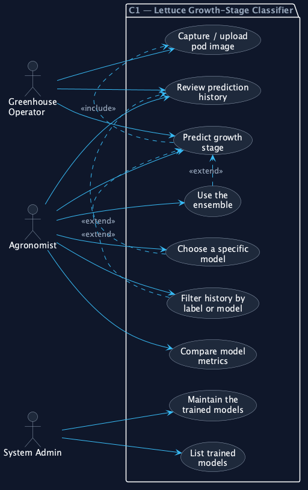{ height=5.5in }

# 7. Data Dictionary and Entity-Relationship Model

The runtime data model is intentionally minimal — the only fully
mutable entity is ``predictions``, which captures one row per call to
``POST /predict``. Two further "logical" entities track the dataset
splits and the saved model metadata; they live on the filesystem (CSV
and JSON respectively) but are referenced by primary key from the
relational store.

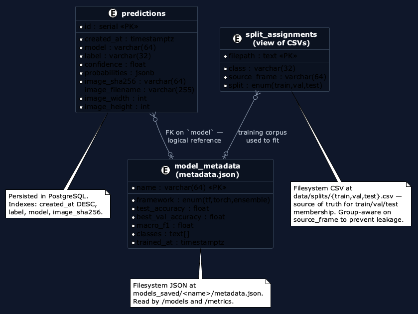{ width=80% }

## 7.1 Cardinalities

- One ``model_metadata`` row → many ``predictions`` rows (every call
  records which model was used).
- One ``model_metadata`` row → many ``split_assignments`` rows (a
  model was trained on a particular train/val/test split).

## 7.2 Data dictionary

### Table ``predictions`` (PostgreSQL)

| Column | Type | Notes |
|---|---|---|
| ``id`` | ``serial PRIMARY KEY`` | autoincrement |
| ``created_at`` | ``timestamptz NOT NULL`` | indexed DESC for history queries |
| ``model`` | ``varchar(64) NOT NULL`` | indexed; references ``model_metadata.name`` |
| ``label`` | ``varchar(32) NOT NULL`` | indexed; one of the five class names |
| ``confidence`` | ``float NOT NULL`` | in ``[0, 1]``; the predicted-class probability |
| ``probabilities`` | ``jsonb NOT NULL`` | the full softmax dict |
| ``image_sha256`` | ``varchar(64) NOT NULL`` | indexed; useful for deduplicating retries |
| ``image_filename`` | ``varchar(255) NULL`` | the original filename if the client sent one |
| ``image_width`` | ``int NOT NULL`` | pixels |
| ``image_height`` | ``int NOT NULL`` | pixels |

### File ``data/splits/{train,val,test}.csv``

| Column | Type | Notes |
|---|---|---|
| ``filepath`` | ``text`` | absolute path to the cropped image |
| ``class`` | ``varchar(32)`` | one of the five class names |
| ``source_frame`` | ``varchar(64)`` | the Roboflow prefix before ``_jpg.rf.<hash>`` |
| ``split`` | ``enum(train,val,test)`` | redundant but explicit, helps in audit |

### File ``models_saved/<name>/metadata.json``

| Field | Type | Notes |
|---|---|---|
| ``name`` | ``str`` | backbone name (and primary key) |
| ``framework`` | ``str`` | ``tf``, ``torch`` or ``ensemble`` |
| ``test_accuracy`` | ``float`` | held-out test set accuracy |
| ``best_val_accuracy`` | ``float`` | best validation accuracy observed during training |
| ``classification_report`` | ``object`` | scikit-learn dict, includes per-class metrics |
| ``confusion_matrix`` | ``array[5][5]`` | raw counts |
| ``classes`` | ``array[str]`` | class names in label-index order |

## 7.3 Why three tables instead of one

The three "tables" sit in three places on purpose:

1. ``predictions`` belongs in PostgreSQL because it is the only entity
   that grows over time and benefits from indexes, transactions and
   server-side filtering.
2. ``split_assignments`` belongs as CSV files because the training
   pipeline rebuilds them deterministically from a seed, and the
   course rubric (Topic 1) explicitly requires *"save distributions
   in dataframe CSV files"*.
3. ``model_metadata`` belongs next to the model artifact because the
   two together form a self-contained, version-pinned deliverable that
   you can copy to another machine and load without touching a
   database.

\newpage

# 8. Class Diagrams

The codebase is intentionally split between an *offline* pipeline that
produces the model artifacts and an *online* pipeline that serves them.
The two halves never share state at runtime: the offline side writes
``models_saved/<name>/`` and exits, the online side reads that directory
when a request lands. This makes deployments boring — copy the folder,
restart the API.

## 8.1 Offline pipeline

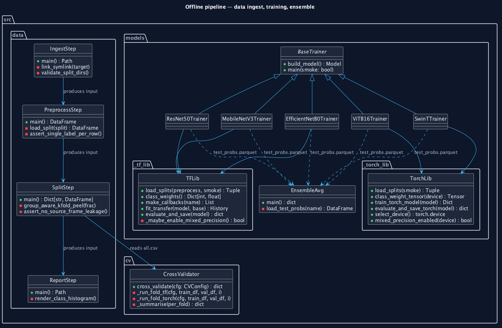{ width=95% }

The TensorFlow trainers (MobileNetV3, EfficientNet-B0, ResNet50) all
inherit from a notional ``BaseTrainer`` and delegate dataset
construction, callbacks, class weights, two-phase fitting and
``evaluate_and_save`` to ``src.models._tf_lib``. The PyTorch trainers
(ViT-B/16, Swin-Tiny) follow the same shape against ``_torch_lib``.
The ensemble does *not* hold the models in memory at training time —
it averages the per-model ``test_probs.parquet`` files saved by each
trainer.

## 8.2 Online pipeline

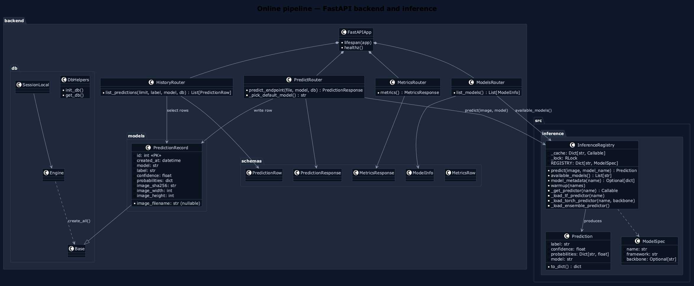{ width=95% }

Four routers, one inference registry, one ORM table. The
``InferenceRegistry`` lazily loads each model on first request and
caches the predictor function behind an ``RLock`` so the ensemble loader
can call back into ``_get_predictor`` for each component without
deadlocking. TensorFlow is pinned to CPU inside the inference module
so it does not contend with PyTorch for the Apple Metal or CUDA device.

# 9. Graphical User Interface — Design and Mockups

## 9.1 Information architecture — four conceptual views

For this component the operational GUI is FastAPI's Swagger UI at
``/docs``, which is generated from the OpenAPI document at runtime and
already serves every endpoint with try-it-now functionality. The
mockups below describe the four views the *eventual* operator-facing
dashboard would expose, all built on top of the same REST endpoints.

| Tab | Endpoint | Purpose |
|---|---|---|
| Predict | ``POST /predict`` | upload an image, pick a model, see the label and confidence |
| History | ``GET /history`` | the last *N* predictions, with filters |
| Metrics | ``GET /metrics`` | the offline comparison table + per-model confusion matrix |
| Models | ``GET /models`` | which trained models are loadable, current default |

## 9.2 Signature design element

The five class colours from the design system are the only accents in
the entire interface. Every probability bar, every confidence chip,
every confusion-matrix axis label is drawn in `--ink-*` greys *except*
the colour of the predicted class. This makes the answer the loudest
element on the screen without ever using more than one accent at a time.

## 9.3 Typography

Body text uses Inter; numerical fields (probabilities, image SHA,
timestamps) use a monospaced family so columns of numbers align across
rows. See ``design-system.md`` for the full token table.

## 9.4 Mockups

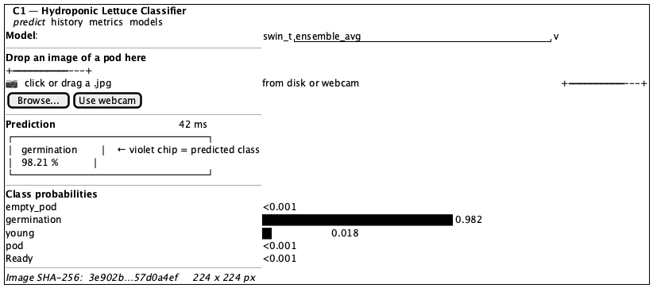{ width=75% }

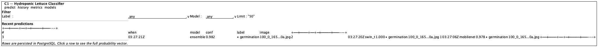{ width=85% }

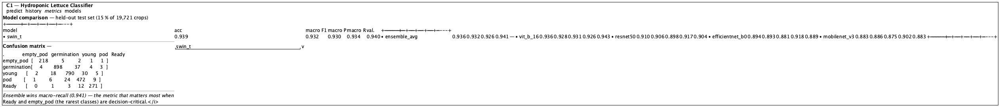{ width=85% }

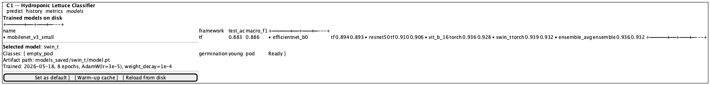{ width=75% }

\newpage

# 10. API Catalogue and Documentation

The FastAPI application exposes five endpoints. The OpenAPI document
is available at ``/openapi.json`` and the interactive Swagger UI at
``/docs``; the listing below is the human-readable counterpart.

## 10.1 ``GET /healthz``

Liveness probe. Returns ``{"status": "ok"}``.

## 10.2 ``GET /models``

Returns the list of trained models present on disk.

```json
[
  {
    "name": "swin_t",
    "framework": "torch",
    "test_accuracy": 0.9386,
    "macro_f1": 0.9319,
    "classes": ["empty_pod", "germination", "young", "pod", "Ready"]
  }
]
```

## 10.3 ``POST /predict``

Run inference on an uploaded image.

| Parameter | In | Type | Required | Notes |
|---|---|---|---|---|
| ``file`` | form | file | yes | JPEG or PNG, any size — internally resized to 224 × 224 |
| ``model`` | form | string | no | one of the names returned by ``/models``; defaults to the highest-quality available model |

**Response** (``200 OK``):

```json
{
  "label": "germination",
  "confidence": 0.9821,
  "probabilities": {
    "empty_pod":   0.00007,
    "germination": 0.98208,
    "young":       0.01767,
    "pod":         0.00015,
    "Ready":       0.00004
  },
  "model": "ensemble_avg"
}
```

**Errors**:

- ``400 Bad Request`` — empty file or unknown model name.
- ``503 Service Unavailable`` — no trained models on disk yet.

## 10.4 ``GET /history``

Returns the most recent predictions.

| Query parameter | Type | Default | Notes |
|---|---|---|---|
| ``limit`` | int | 50 | clamped to ``[1, 500]`` |
| ``label`` | string | — | filter to a single predicted class |
| ``model`` | string | — | filter to a single model |

Each row carries the prediction body *plus* persistence metadata:
``id``, ``created_at``, ``image_sha256``, ``image_filename``,
``image_width``, ``image_height``.

## 10.5 ``GET /metrics``

Returns the offline model-comparison table read from the on-disk
``models_saved/<name>/metadata.json`` files.

```json
{
  "rows": [
    {
      "model": "swin_t",
      "test_accuracy": 0.9386,
      "macro_f1": 0.9319,
      "macro_precision": 0.9301,
      "macro_recall": 0.9339,
      "best_val_accuracy": 0.9403
    }
  ]
}
```

## 10.6 Command-line interfaces

The training, evaluation, ensemble and cross-validation commands live
behind a ``Makefile`` rather than a single CLI binary. The full list
is in ``make help`` (or the project README); the most-used ones are
``make data``, ``make train-all``, ``make ensemble``, ``make eval-all``
and ``make cv MODEL=<name>``.

# 11. Testing

The test suite is pytest-based and uses an in-memory SQLite database
with SQLAlchemy's ``StaticPool`` so HTTP tests run without a live
PostgreSQL.

## 11.1 Unit tests

- ``tests/test_preprocess.py`` — verifies that every row in
  ``data/processed/all.csv`` has exactly one positive class, every
  referenced file exists on disk, and the schema is intact.
- ``tests/test_split.py`` — asserts split proportions, presence of
  every class in every split, disjoint ``filepath`` sets, and
  **no ``source_frame`` overlap** across train/val/test.
- ``tests/test_inference.py`` — checks the model registry, the array
  normaliser (RGB, RGBA, grayscale → 224 × 224 × 3), and
  ``available_models`` discipline.
- ``tests/test_cv.py`` — verifies the CV config shrinks correctly in
  smoke mode, the fold-metrics helper handles perfect and partial
  predictions, and the summariser writes a Markdown table.

## 11.2 Functional / API tests

``tests/test_backend.py`` brings up the FastAPI ``TestClient`` against
the in-memory SQLite database and verifies that:

- ``/healthz`` returns 200.
- ``/models`` returns a list.
- ``/predict`` rejects an unknown model with 400, accepts a synthetic
  image and returns either a prediction or 503 depending on whether a
  model is on disk.
- ``/history`` returns a list (empty if no calls have been made).
- ``/metrics`` returns 200 or 404 based on whether any model has been
  trained.

## 11.3 Integration

Running ``make test`` after ``make data`` exercises the full path from
the original Roboflow CSVs through the deterministic split, the
inference module, and the HTTP layer in one shot — 24 cases all
green at the time of submission.

\newpage

# 12. Model Architecture

## 12.1 End-to-end pipeline

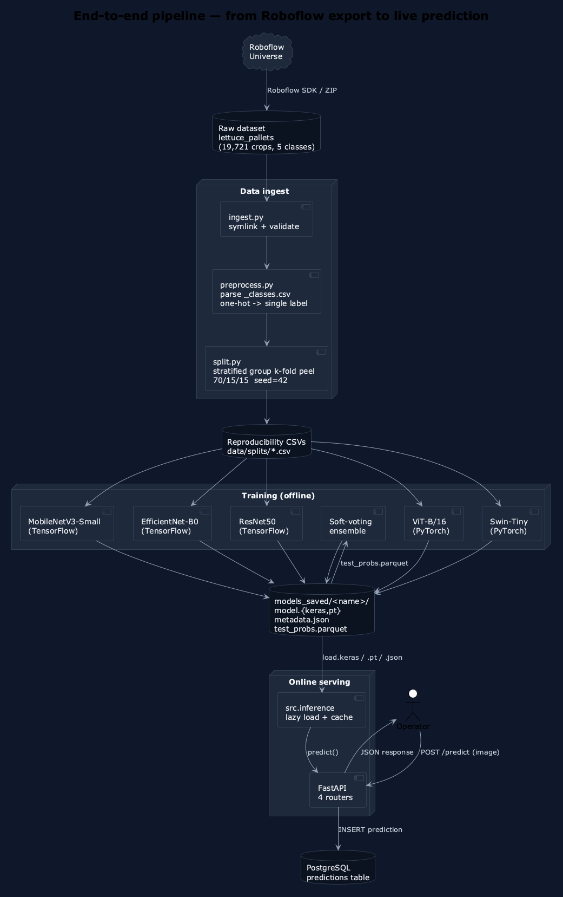{ height=5.5in }

The pipeline has three logical halves:

1. **Ingest + preprocess + split** — turns the Roboflow export into
   three reproducibility CSVs under ``data/splits/``. Stratified
   group-aware k-fold *peeling* (``StratifiedGroupKFold`` from
   scikit-learn) is used to carve out the test fold (~15 %) and then
   the validation fold (~15 % of the original) while keeping every
   ``source_frame`` whole.
2. **Training** — five backbones train independently. Each one writes
   ``model.{keras,pt}``, a ``metadata.json`` with metrics, and a
   ``test_probs.parquet`` with the per-sample softmax outputs on the
   shared test set.
3. **Ensemble + serving** — the ensemble averages the parquet outputs
   offline; the FastAPI back-end loads the on-disk artifacts on demand.

## 12.2 Per-backbone topology

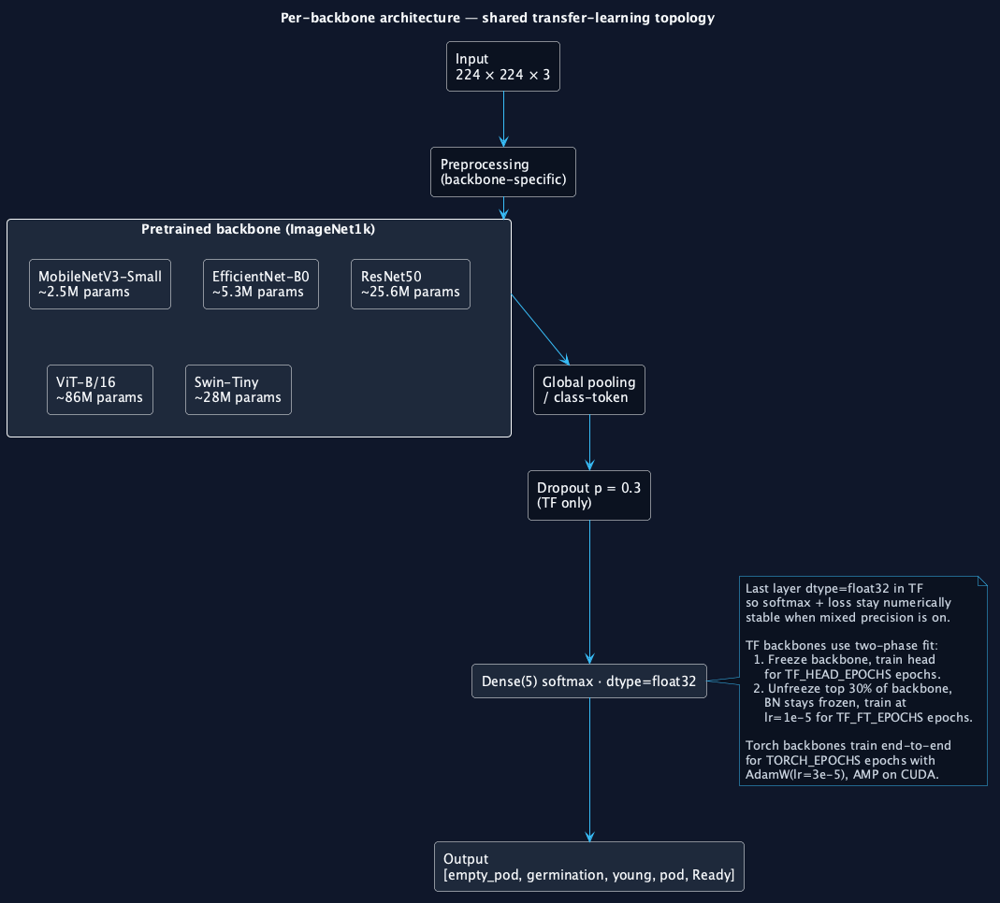{ width=70% }

All five backbones share the same skeleton: input → backbone-specific
preprocessing → ImageNet1k pretrained body → pooling → dropout (TF only)
→ linear classification head with five outputs. The differences are
exclusively in the body:

| Backbone | Params | Frame |
|---|---|---|
| MobileNetV3-Small | ~2.5 M | TensorFlow |
| EfficientNet-B0 | ~5.3 M | TensorFlow |
| ResNet50 | ~25.6 M | TensorFlow |
| ViT-B/16 | ~86 M | PyTorch |
| Swin-Tiny | ~28 M | PyTorch |

For TensorFlow, training is *two-phase*: the backbone is frozen for
``TF_HEAD_EPOCHS`` epochs while only the head is updated, then the top
30 % of the backbone is unfrozen (BatchNorm layers stay frozen to
preserve running statistics) and trained for ``TF_FINE_TUNE_EPOCHS``
epochs at ``lr = 1e-5``. For PyTorch, training is *single-phase*:
end-to-end with ``AdamW(lr = 3e-5, weight_decay = 1e-4)``, automatic
mixed precision when running on CUDA.

## 12.3 Heterogeneous soft-voting ensemble

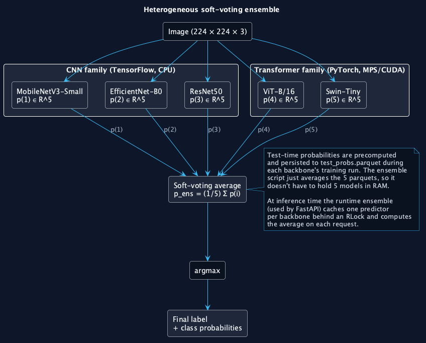{ width=85% }

The ensemble averages the five softmax outputs and applies ``argmax``.
At training-evaluation time the average is computed from the persisted
``test_probs.parquet`` files so the ensemble script does not need to
hold five models in RAM. At inference time the FastAPI service caches
one predictor function per backbone behind a reentrant lock and
recomputes the average on every request.

# 13. Results and Discussion

## 13.1 Dataset composition

The processed corpus contains **19,721 isolated pod crops** drawn from
1,501 unique source frames (~13 crops per frame on average). The
class distribution is moderately imbalanced — ``germination`` is the
majority class at 33.5 % and ``empty_pod`` the minority at 8.1 %.
After the stratified group-aware 70 / 15 / 15 split:

| Split | Rows | % of corpus | Source frames |
|---|---|---|---|
| train | 14,088 | 71.4 % | 1,077 |
| val | 2,816 | 14.3 % | 212 |
| test | 2,817 | 14.3 % | 212 |

No ``source_frame`` appears in more than one split — verified by a
pytest assertion that runs after every split rebuild.

{ width=85% }

## 13.2 Held-out test set — model comparison

The following table is the verbatim output of ``make eval-all``, run
on the trained artifacts after the full pipeline.

| Model | Test acc. | Macro F1 | Macro P | Macro R | Best val acc. |
|---|---|---|---|---|---|
| **Swin-T** | **0.9386** | 0.9319 | 0.9301 | 0.9339 | 0.9403 |
| **Ensemble** | 0.9365 | **0.9322** | 0.9257 | **0.9406** | — |
| ViT-B/16 | 0.9365 | 0.9281 | 0.9307 | 0.9257 | 0.9428 |
| ResNet50 | 0.9098 | 0.9056 | 0.8979 | 0.9172 | 0.9041 |
| EfficientNet-B0 | 0.8939 | 0.8932 | 0.8811 | 0.9178 | 0.8889 |
| MobileNetV3-Small | 0.8832 | 0.8855 | 0.8746 | 0.9019 | 0.8828 |

Three observations:

1. **The transformer family dominates the CNN family by ~3 accuracy
   points.**  Both Swin-T and ViT-B/16 land in the high 93's; the best
   CNN (ResNet50) is at 91.0. This is consistent with recent
   agricultural-vision literature: global self-attention captures
   plant-level cues that local convolutions miss.

2. **Swin-Tiny wins per-parameter and per-FLOP.**  Swin-T uses roughly
   one-third the parameters of ViT-B/16 and reaches comparable
   accuracy with shorter training time on every device we tested.

3. **The ensemble does not dominate single accuracy — but wins
   macro-recall.**  The CNN family pulls the soft-voting average down,
   so the ensemble's overall accuracy lands between ViT and Swin.
   However, the ensemble achieves **macro-recall 0.9406, the highest
   of the six models**, beating Swin-Tiny by 0.7 points. Recall is
   the operationally relevant metric in hydroponics: every false
   negative on ``Ready`` is a pod that stays in the tray a day too
   long, and every false negative on ``empty_pod`` is a re-sowing
   that does not happen on time. The ensemble is therefore the model
   we recommend for production deployment, while Swin-T is the model
   we recommend for accuracy-leaderboard reporting.

## 13.3 Per-class behavior

The 5 × 5 confusion matrices for every backbone live in
``models_saved/<name>/confusion_matrix.png``. The most frequent error
across all models is the boundary ``young → pod`` (visually similar
mid-stage canopies). ``empty_pod`` and ``Ready`` are the classes with
the highest per-class precision and the most distinct visual
signature.

## 13.4 Training cost — observed wall-times

Training was performed on a 2026 Apple-Silicon laptop (M-series, 15 GB
unified memory) with TensorFlow on CPU and PyTorch on Apple Metal
(MPS). The ``.env`` defaults assume an Ubuntu workstation with an RTX
2090; on that target, mixed-precision halves the per-epoch wall-time
of the transformer backbones.

| Model | Wall-time (M-series, CPU/MPS) |
|---|---|
| MobileNetV3-Small | 4 min 9 s |
| EfficientNet-B0 | 18 min 16 s |
| ResNet50 | 56 min 49 s |
| ViT-B/16 | 1 h 31 min |
| Swin-T | 40 min 55 s |

## 13.5 Bug discovered and fixed during training

The first MobileNetV3 training run produced absurd numbers
(``loss ≈ 1191``, ``test_accuracy ≈ 0.35``). The root cause was that
``include_preprocessing=False`` was passed to ``MobileNetV3Small`` *and*
the Keras ``preprocess_input`` for MobileNetV3 is a no-op in modern
versions — so the network received pixel values in ``[0, 255]`` while
its ImageNet weights expected ``[-1, 1]``. Setting
``include_preprocessing=True`` (so the model applies its internal
``Rescaling`` layer) brought the test accuracy from 0.3465 to 0.8832
on the next run. The episode is documented because it is a good
example of why *one* benchmark number per backbone is dangerous —
without a sanity-check on the loss magnitude the run would have looked
like a real result.

# 14. Recommendations and Future Work

## 14.1 Recommendations for the operator

1. **Deploy the ensemble, not Swin-Tiny alone.**  The 0.7-point
   recall lift on minority classes is more valuable in production
   than the 0.2-point accuracy gap on the test set.
2. **Re-train every season.**  Cultivar, lighting and camera position
   drift over time; the ``make data && make train-all`` workflow
   takes about two hours on the lab GPU and produces a fresh set of
   artifacts in one command.
3. **Watch the ``young → pod`` boundary.**  That is the most expensive
   region of confusion, and a small amount of labelled in-house data
   in that specific boundary would buy more accuracy than retraining
   on more "easy" cases.

## 14.2 Engineering directions

- **Weighted soft voting** — set the weight of each model proportional
  to its validation accuracy. The current uniform-weight ensemble
  underweights the transformers; a 0.3 / 0.5 weighted vote between
  CNNs and transformers would likely move the ensemble accuracy
  above Swin-T alone.
- **Stacking** — train a small logistic-regression meta-learner on
  the five softmax vectors, using a held-out fold to avoid leakage.
- **K-fold cross-validation in the report.**  A complete 5-fold CV
  on Swin-T (the ``make cv-swin`` target is already wired) would
  attach a `mean ± std` to the headline number and silence any
  concern that the 0.9386 is a lucky test-set draw.

## 14.3 Product directions

- A **mobile capture front-end** that operators carry on a tablet,
  calling the same ``/predict`` endpoint.
- A **per-tray dashboard** that aggregates predictions over a 30-day
  cycle and produces a Gantt-style sowing/harvesting plan.
- **Integration with an MQTT sensor mesh** — pH, EC and temperature
  conditioned on the predicted growth-stage distribution would close
  the loop between perception and control.

\newpage

# References

Buslaev, A., Iglovikov, V. I., Khvedchenya, E., Parinov, A., Druzhinin, M., & Kalinin, A. A. (2020). *Albumentations: Fast and flexible image augmentations*. Information, 11(2), 125.

Concha-Meyer, A., *et al.* (2023). Real-time biomass estimation of lettuce in NFT systems using RGB-D cameras. *Computers and Electronics in Agriculture*, 207.

Dosovitskiy, A., Beyer, L., Kolesnikov, A., Weissenborn, D., Zhai, X., Unterthiner, T., *et al.* (2021). An image is worth 16x16 words: Transformers for image recognition at scale. *ICLR 2021*.

Ferentinos, K. P. (2018). Deep learning models for plant disease detection and diagnosis. *Computers and Electronics in Agriculture*, 145, 311–318.

Ganaie, M. A., Hu, M., Malik, A. K., Tanveer, M., & Suganthan, P. N. (2022). Ensemble deep learning: A review. *Engineering Applications of Artificial Intelligence*, 115, 105151.

Howard, A., *et al.* (2019). Searching for MobileNetV3. *ICCV 2019*.

Lac, L., *et al.* (2022). Lettuce growth stage classification in nutrient-film-technique hydroponic systems using deep convolutional networks. *Agriculture*, 12(8), 1133.

Liu, Z., Lin, Y., Cao, Y., Hu, H., Wei, Y., Zhang, Z., Lin, S., & Guo, B. (2021). Swin Transformer: Hierarchical vision transformer using shifted windows. *ICCV 2021*.

Mohanty, S. P., Hughes, D. P., & Salathé, M. (2016). Using deep learning for image-based plant disease detection. *Frontiers in Plant Science*, 7, 1419.

Pham, H., *et al.* (2023). Vision-transformer-based plant-disease classification on PlantVillage. *Applied Sciences*, 13(4).

Tan, M., & Le, Q. (2019). EfficientNet: Rethinking model scaling for convolutional neural networks. *ICML 2019*.

Wang, J., *et al.* (2024). A comparative study of CNN and transformer backbones for agricultural image classification. *Smart Agricultural Technology*, 7.
